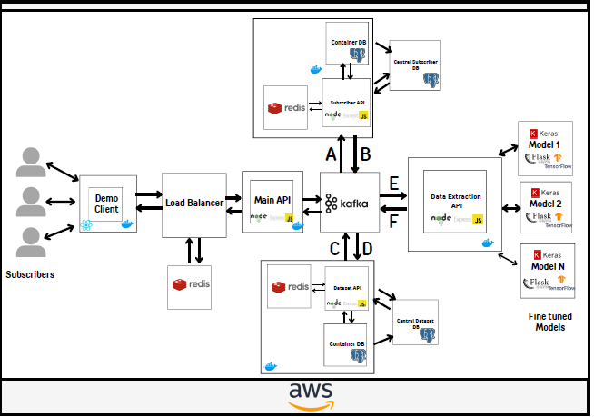

# SARNET 
A deep learning model designed for data operations and colorization of SAR images, offering a fast and efficient service for optimized data collection. It empowers individuals, analysts, and businesses with better insights, easily integrates into existing aerospace systems, and enhances image and data collection capabilities. The model is built to minimize the loss function between prediction and reality, ensuring high accuracy and reliability.

## App Architecture 

- **Demo Client**: Enables users and the evaluation committee to explore our SaaS capabilities and envision future applications.
- **Load Balancer**: Balances the load across virtual machines using AWS Auto Scaling Groups.
- **Main API**: Coordinates between all the other services running, ensuring seamless execution and development.
- **Kafka Container**: Supports an event-driven architecture among the three main entities and manages their intercommunication.
- **A**: Handles requests related to asking for existing dataset data.
- **Subscriber API**: Allows users and organizations to subscribe to our service and access our dataset by managing their subscription.
- **B**: Requests data from a dataset with specified parameters and returns it to the main API.
- **Container's DB**: Utilized for create, update, and delete operations to avoid overload on the central DB.
- **Central Subscriber DB/Central Dataset DB**: Data is transferred from the container DB to the central DB upon instance shutdown, while still being available for read queries on existing datasets.
- **C**: Handles requests related to datasets.
- **D**: Handles responses to send to customers.
- **Dataset API**: Manages complex queries with PostgreSQL, including large dataset queries, creating and updating datasets, while coordinating communication between the central and container DBs to optimize resource use.
- **Data Extraction API**: Handles image processing and data extraction. It processes a series of images and returns a dataset based on the relevant parameters.
- **E**: Handles series of images for a given model.
- **F**: Returns a new collection which will be added/updated to the dataset.

## References

### Dataset Links:
- [NISAR Sample Data](https://nisar.jpl.nasa.gov/data/sample-data/)
- [High-Resolution SAR Images Dataset (HRSID) on Kaggle](https://www.kaggle.com/datasets/sarribere99/high-resolution-sar-images-dataset-hrsid)
- [ICEYE Datasets](https://www.iceye.com/resources/datasets)
- [SAR RadarCon 2018 Research Work](https://engineering.jhu.edu/vpatel36/wp-content/uploads/2018/08/SAR_RadarCon_2018.pdf)

### Research Work:
- SERVIR SAR Handbook: Comprehensive Methodologies for Forest Monitoring and Biomass Estimation.
- NISAR Science User's Handbook.
- NASA Earthdata: NISAR Data Access and Processing Guide.

## How to run the Project